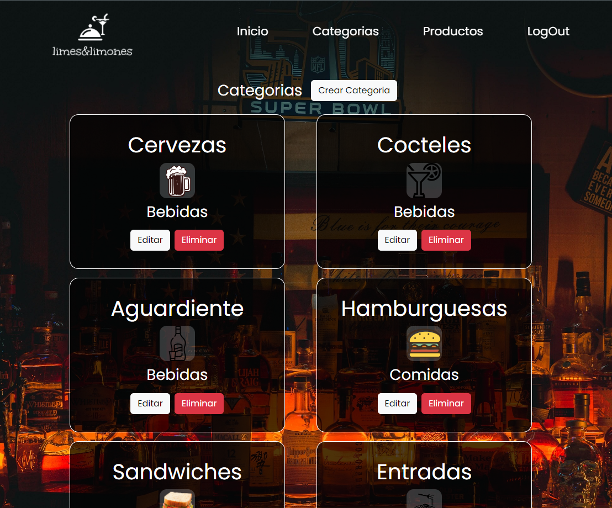
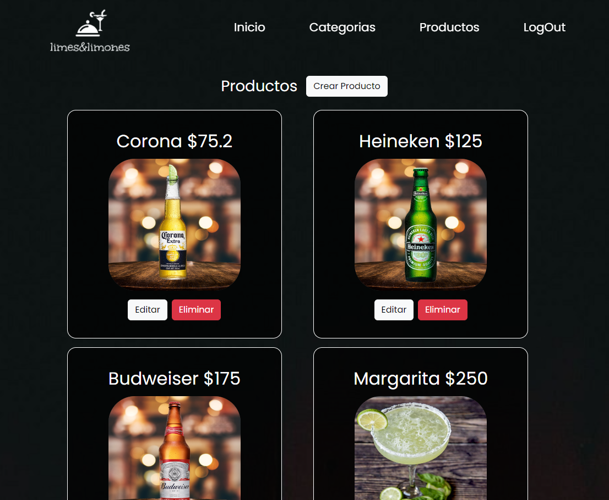
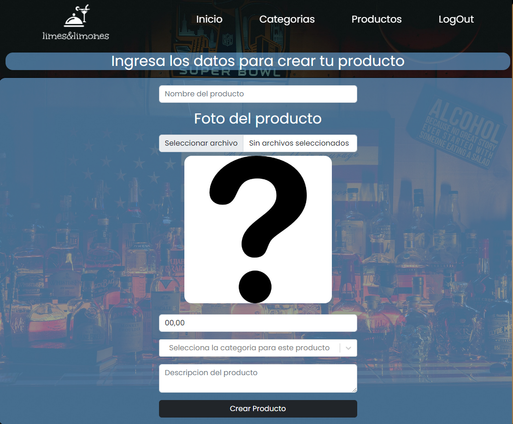
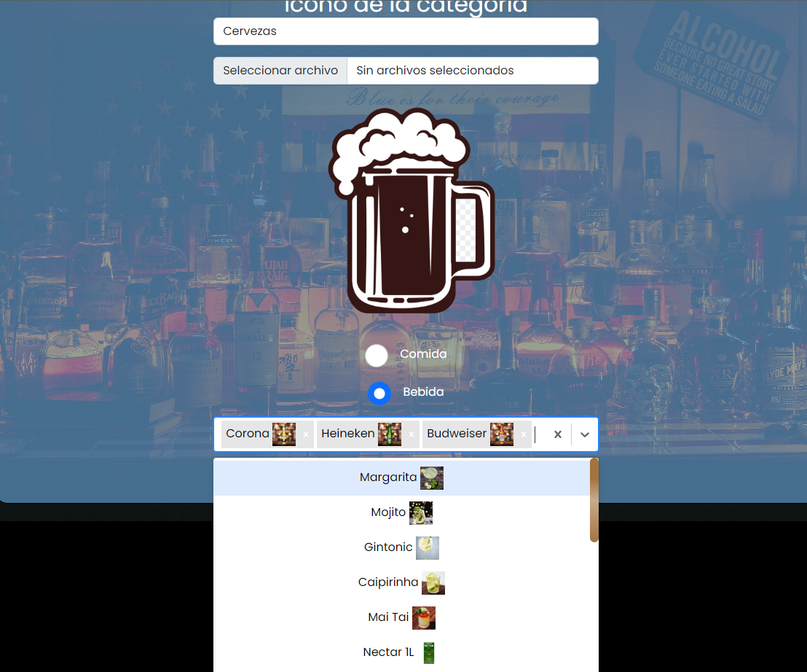
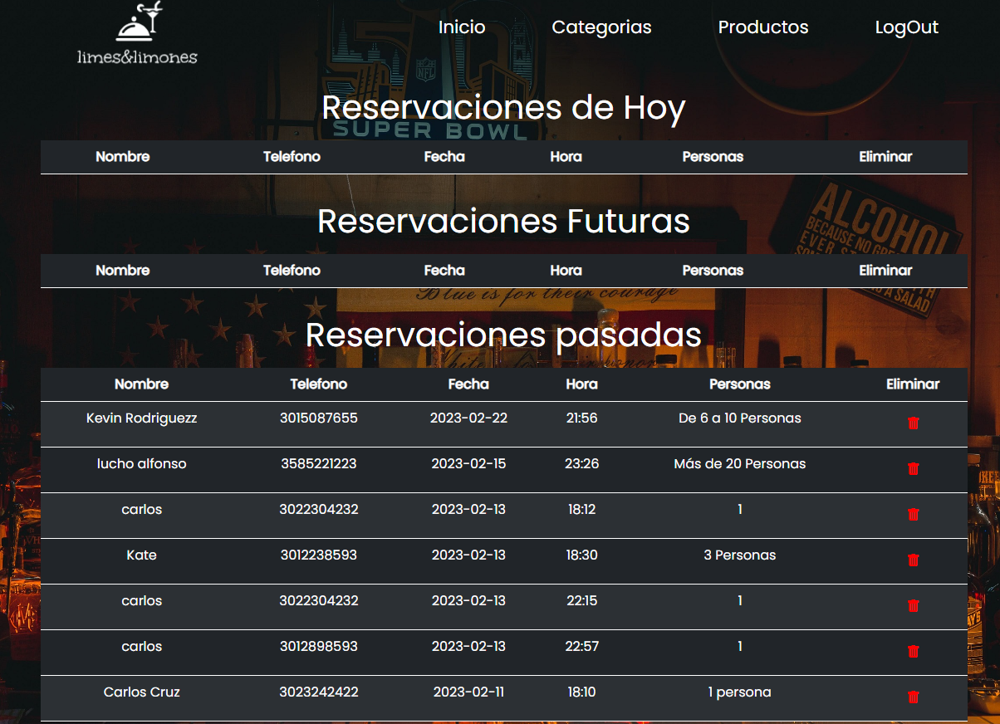
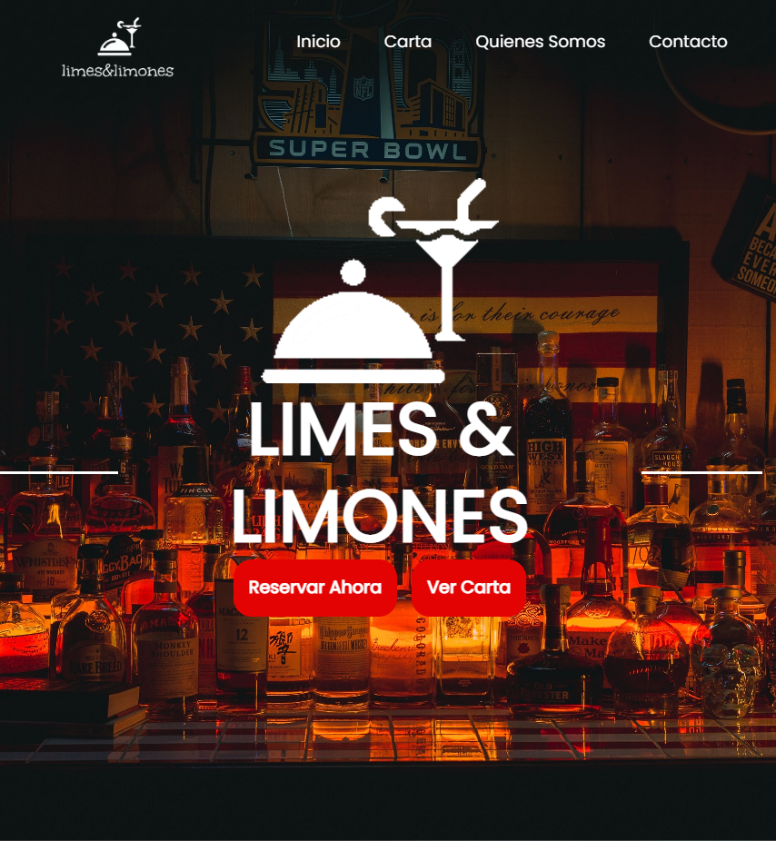
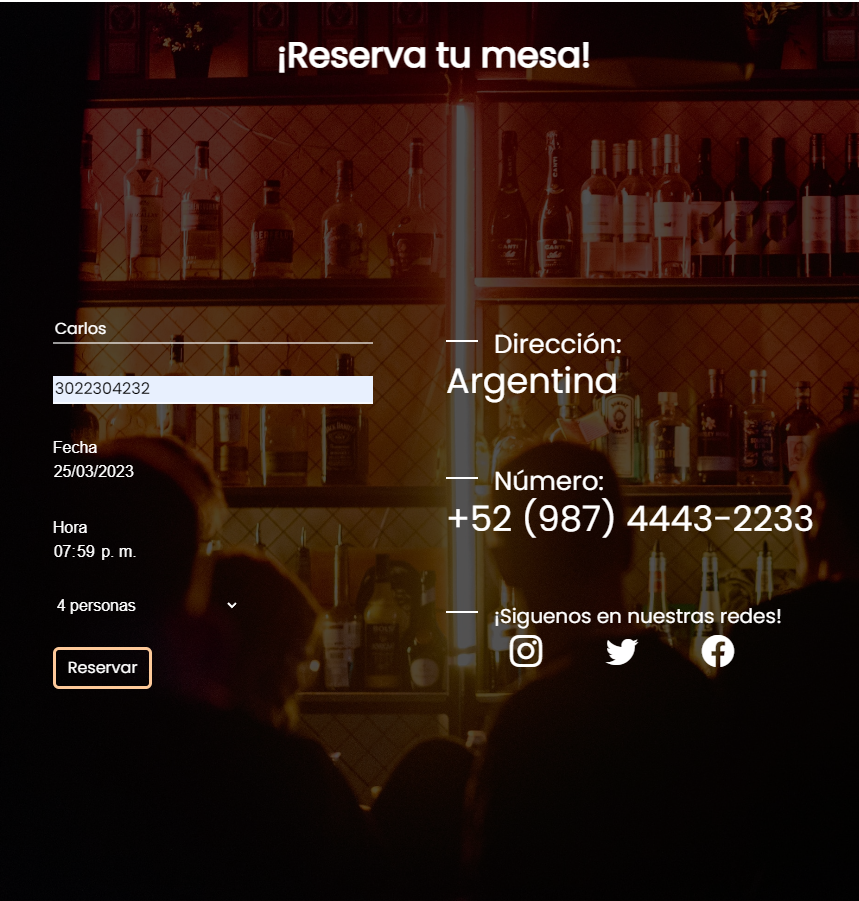
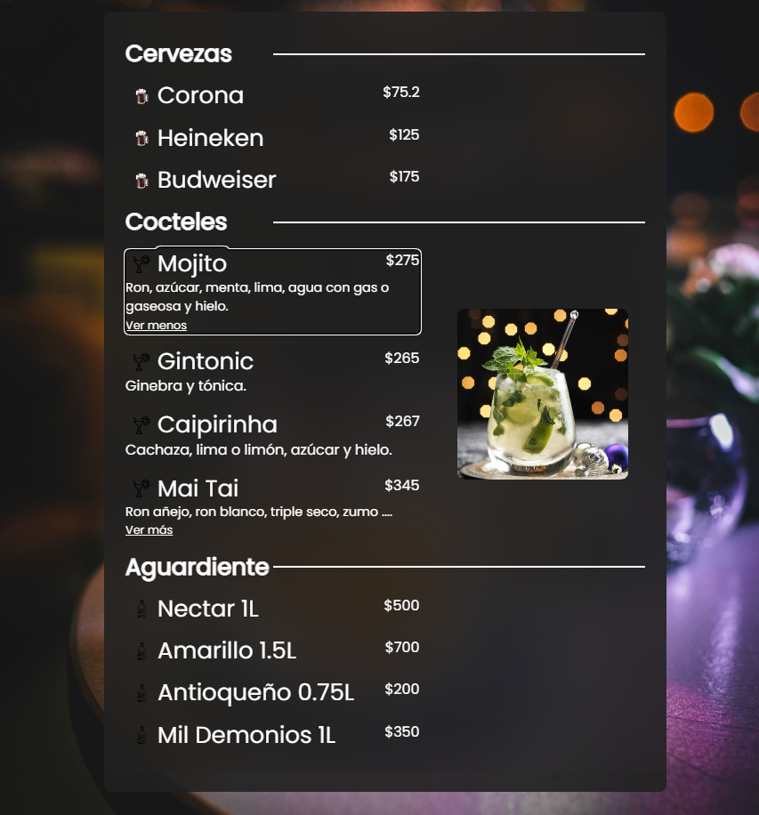

# Web para restaurante Limes y Limones

Este proyecto es fue diseñado para un gastro bar, tiene diseñada en back y front una parte para los usuarios y comenzales del restaurante y tambien una parte administrativa diseñada para los dueños del restaurante 

## Desde la vista de administración se puede

Crear, Editar, Ver y Eliminar Productos y categorias

Se pueden relacionar los productos a las respectivas categorias 

Tambien se puede tener un control completo de las reservaciones 

## Desde la vista de los usuarios

Puedes ver el lindo diseño de la web

Puedes hacer reservaciones

Puedes consultar la carta de forma interactiva

## 🔗 DEMO:

🤖Link Demo:(https://instagremi.vercel.app/home)

# Lenguajes de Programación y Frameworks

  
  

    
  
    
  

## 🔗 Links:

## Sobre Mi 

¡Hola! Me llamo Carlos, apasionado por la programación.

Me motiva aprender cada vez más, me apasiona el desarollo, he imaginar y luego programar algo en diferentes lenguajes como Python y JavaScript

Mi objetivo principal es aprender tecnologías que me permitan desenvolverme profesionalmente como desarrollador de software.

# Herramientas

  
  
  

